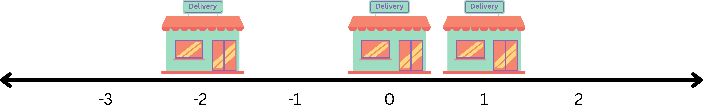
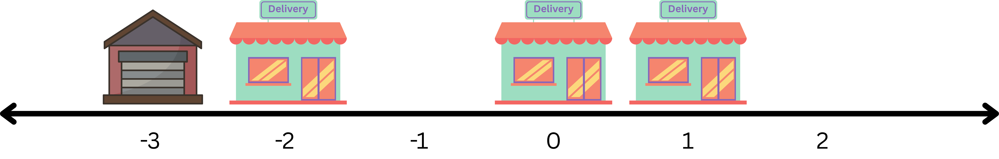
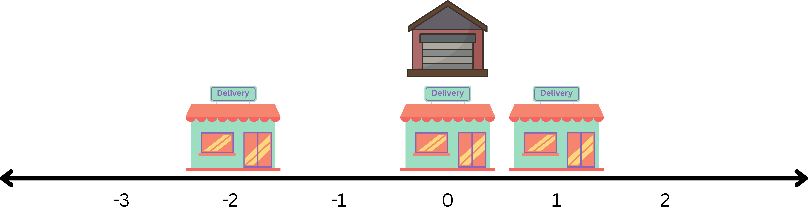
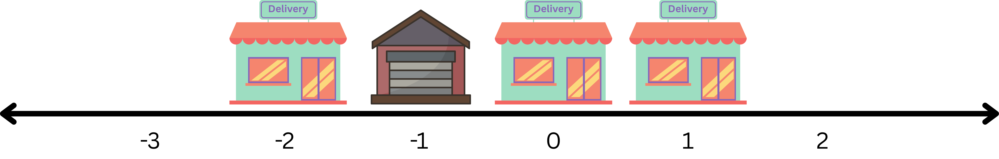

# Locate Warehouse

Amazon has multiple delivery centers and delivery warehouses all over the world! The world is represented by a number line from -10⁹ to 10⁹. There are `n` delivery centers, the `iᵗʰ` one at location `center[i]`.

A location `x` is called a **suitable location** for a warehouse if it is possible to bring all the products to that point by traveling a distance of **no more than `d`**. At any one time, products can be brought from one delivery center and placed at point `x`.

Given the positions of `n` delivery centers, calculate the number of suitable locations in the world. That is, calculate the number of points `x` on the number line (`-10⁹ ≤ x ≤ 10⁹`) where the **travel distance** required to bring all the products to that point is **less than or equal to `d`**.

> 💡 **Note:**  
> The distance between point `x` and `center[i]` is `|x - center[i]|`, their absolute difference.

## Example

Given:

```ts
n = 3;
center = [-2, 1, 0];
d = 8;
```

## 

_The various locations along with the distance traveled to bring all treasures at that point are 👇:_

- 
  Locate the warehouse at `x = -3`. First bring products from `center[0] = -2` covering a distance of `|-3 - (-2)| = 1` to reach the center and `|-3 - (-2)| = 1` to return. Similarly we bring products from centers 1 and 2 to point -3 for total distance of `1 + 1 + 4 + 4 + 3 + 3 = 16` which is `> d`. This is not a suitable location ❌.

---

- 
  Locate the warehouse at `x = 0`, total distance traveled is `2 * |0 - (-2)| + 2 * |0 - 1| + 2 * |0 - 0| = 6 ≤ d`. This is a suitable location ✅.

---

- 
  Locate the warehouse at `x = -1`, total distance traveled is `2 * |-1 - (-2)| + 2 * |-1 - 1| + 2 * |-1 - 0| = 8 ≤ d`. This is a suitable location ✅.

---

- 
  Locate the warehouse at `x = 1`, total distance traveled is `2 * |1 - (-2)| + 2 * |1 - 1| + 2 * |1 - 0| = 8 ≤ d`. This is a suitable location ✅.

---

The only suitable locations are `{-1, 0, 1}`.

**Return:** `3`

## Function Description

Complete the function `suitableLocations`.

```ts
function suitableLocations(center: number[], d: number): number;
```

### Parameters

- _int_ `center[n]`: the positions of delivery centers
- _long_ `d`: the maximum allowed total travel distance for a suitable location

### Returns

- _int_: the number of suitable locations

## Constraints

- 1 ≤ n ≤ 10⁵
- -10⁹ ≤ center[i] ≤ 10⁹
- 0 ≤ d ≤ 10¹⁵

## More examples

**Input format:** The first line contains an integer, `n`, the number of elements in `center`. Each line `i` of the `n` subsequent lines (where _0 ≤ i < n_) contains an integer, `center[i]`. The last line contains one integer `d`, the maximum allowed total required travel distance.

<details>
<summary>Sample Case 0</summary>

#### Sample Input

```
STDIN   FUNCTION
-----   --------
4     -> center[] size n = 4
2     -> center = [2, 0, 3, -4]
0
3
-4
22    -> d = 22
```

#### Sample Output

```
5
```

#### Explanation

There are 5 suitable locations i.e `{-1, 0, 1, 2, 3}`.

- Place a warehouse at `x = -1`, total distance traveled is `2 * |−1 − 2| + 2 * |−1 − 0| + 2 * |−1 − 3| + 2 * |−1 − (−4)| = 22 ≤ d` ✅.
- `x = 0`, total distance traveled is `2 * |0 - 2| + 2 * |0 - 0| + 2 * |0 - 3| + 2 * |0 - (-4)| = 18 ≤ d` ✅.
- `x = 1`, total distance traveled is `2 * |1 - 2| + 2 * |1 - 0| + 2 * |1 - 3| + 2 * |1 - (-4)| = 18 ≤ d` ✅.
- `x = 2`, total distance traveled is `2 * |2 - 2| + 2 * |2 - 0| + 2 * |2 - 3| + 2 * |2 - (-4)| = 18 ≤ d` ✅.
- `x = 3`, total distance traveled is `2 * |3 - 2| + 2 * |3 - 0| + 2 * |3 - 3| + 2 * |3 - (-4)| = 22 ≤ d` ✅.
</details>

<details>
<summary>Sample Case 1</summary>

#### Sample Input

```
STDIN   FUNCTION
-----   --------
3     -> center[] size n = 3
-3    -> center = [-3, 2, 2]
2
2
8     -> d = 8
```

#### Sample Output

```
0
```

### Explanation

It can be shown that there are no suitable locations.

For example, if a warehouse is placed at `x = 2`, then total distance traveled is `2 * |2 − (−3)| + 2 * |2 − 2| + 2 * |2 − 2|) = 10 > d` ❌.

</details>
